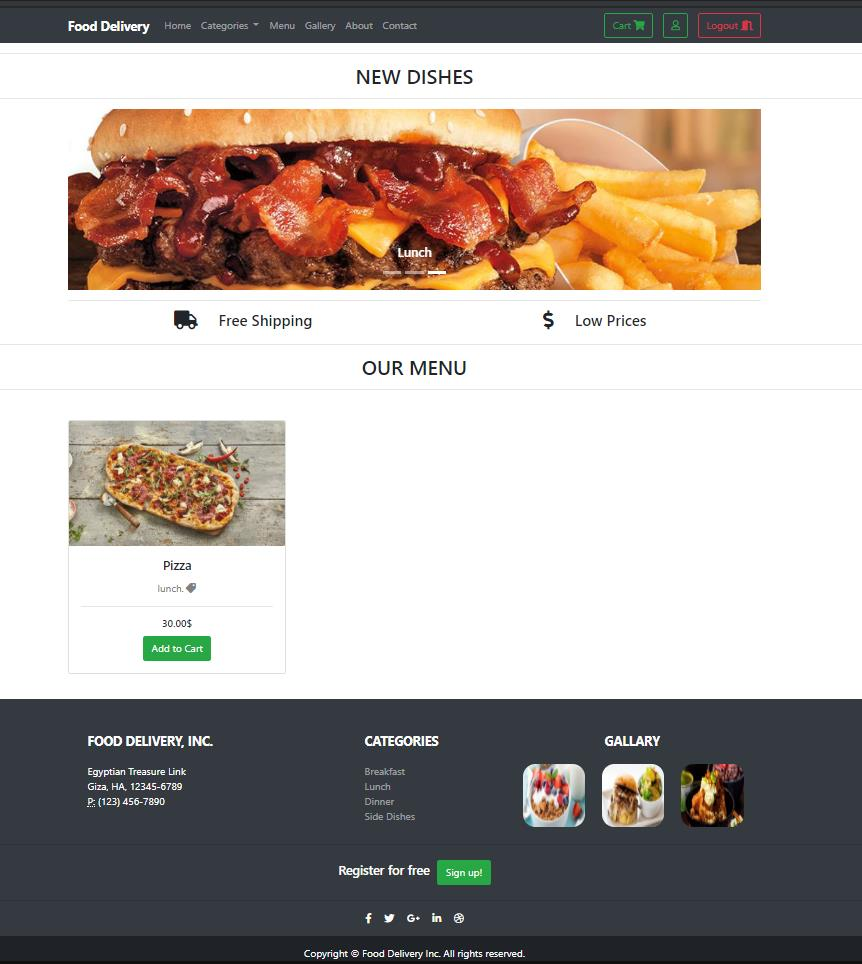
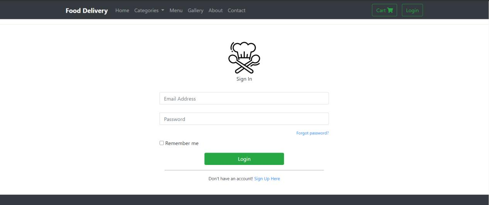
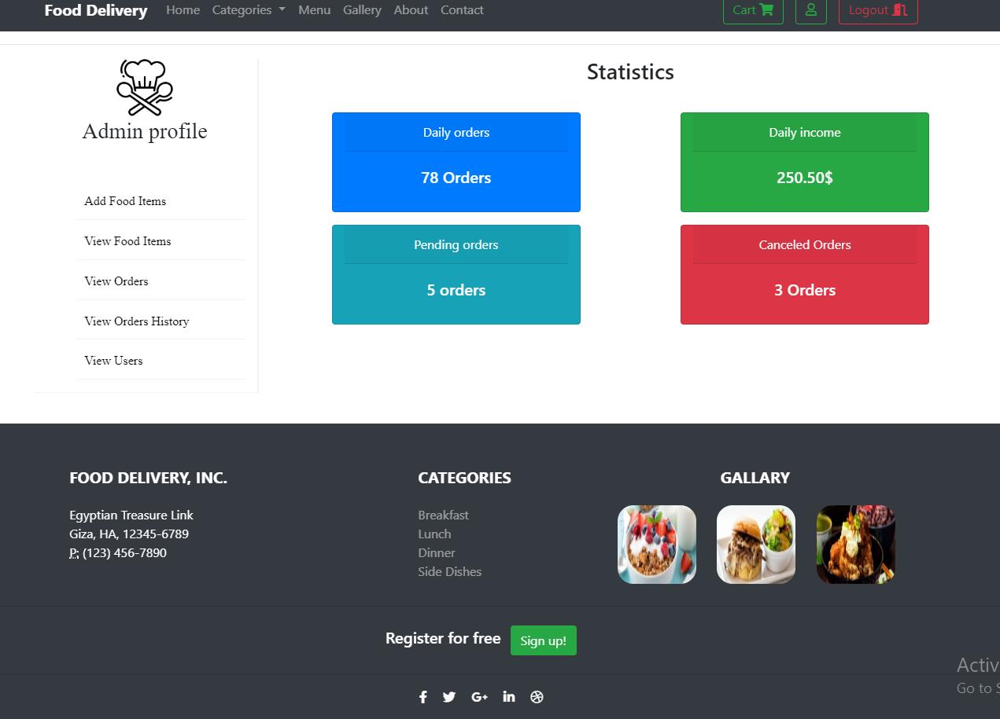
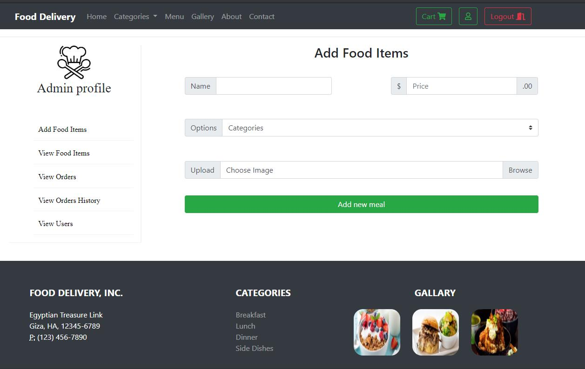
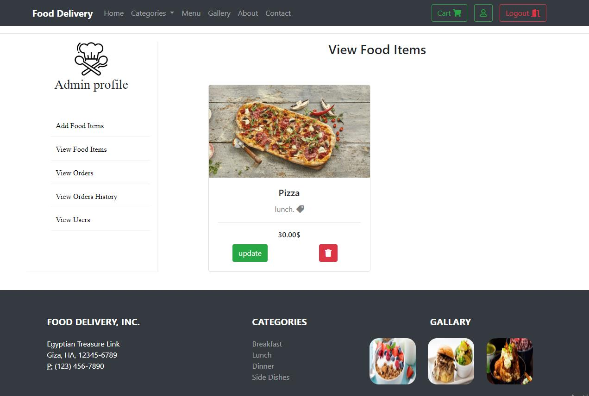

# Online Food Ordering System 🛵🍕🍟🌭

**Technologies:**
- HTML
- CSS
- Bootstrap
- PHP [MVC]
- MySQL

#

**Admin:**
-	Login/Logout: User have to login with their credentials to access food ordering system. 
-	Add Food Items: Admin can add food items details like name, Photo, Price, Category etc.
-	View / Edit (Price, Enable/Disable) / Delete Items: Admin can view, edit the food items details as well as Enable/Disable food items according to season or availability.
-	View live orders: Admin can track live orders and Status Update for particular food delivery.
-	View oders history: admin can view order history.
-	View Users: Admin can view the users’ details which are given during registration.

**User:**
-	Register: User have to register with essential details for food ordering system.
-	Login/Logout: User have to login with their credentials to access food ordering system.
-	Menu List: Different food items with respective categories viewable to user.
-	View Cart(add, update, delete): User can view their cart details, delete food items from cart, update quantity etc.
-	Buy Products: User can buy the products in cart buy doing cash payment. 
-	View Orders and Status: User can keep track of their orders with delivery status.

**Advantages:**
-	Customer can check the food items details with prices efficiently.
-	Customer can keep track of their orders too.
#

**Images from the system:**

